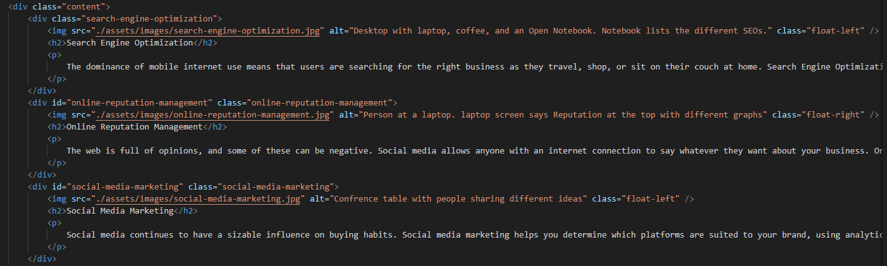
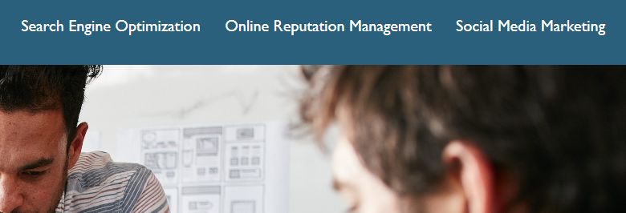

# horizon-c1

## Installation

To set up my development environment, I first created a repository in GitHub to store my code. I then downloaded the client’s content that needed to be refactored. 

Going over the index.html, I noticed the images needed the [alt] attribute to be added to make the website more accessible for anyone who cannot view the image due to a slow connection or the need for a screen reader.

```md

```

I next fixed the broken link that should have taken you to the Search Engine Optimization portion of the website. It needed the [class] selector to be updated to the [id] selector to read the style.css sheet correctly and perform the task.

Search Engine Optimization, Online Reputation Management, and Social Media Marketing [id] selectors were consolidated to remove excess code from the CSS style sheet. 

## Usage 

This website is set up to be easy to use. Simple pick the topic you are most interested in from the top right corner:
‘’’md

‘’’

And it will take you to that section without having to scroll down:
‘’’md

‘’’

For added convenience, you can also view the entire web page by using the scroll bars with your mouse or touchpad.

## Credits

https://www.w3schools.com/html/default.asp 
https://www.w3schools.com/css/default.asp


## License

The last section of a good README is a license. This lets other developers know what they can and cannot do with your project. If you need help choosing a license, use [https://choosealicense.com/](https://choosealicense.com/)

